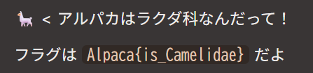

## 問題理解
CTFってなんぞやという問題です。
```
CTF（Capture The Flag）は、情報セキュリティの専門知識や技術を駆使して、隠された「Flag（フラグ）」と呼ばれる文字列を見つけ出し、得点を競うコンテストです。サイバーセキュリティ分野のスキル向上、脆弱性の探索、暗号解読など、ゲーム感覚でハッキングの技術を実践的に学べる場として人気があります。 (引用：gemini)
```
この問題難易度にはwelcomeとある通り、CTF最初に解くような見てわかるような問題である。気合で解こう。
## 解法

この問題は上記画像にあるようにフラグは`Alpaca{is_Camelidae}`とあるのでそれを解答フォームに入れてみると…