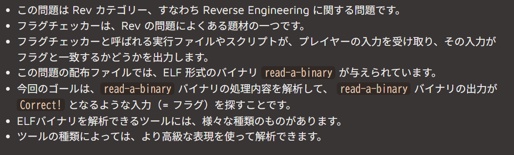
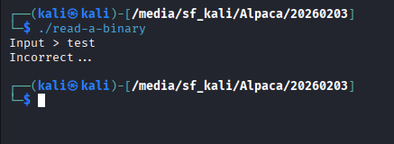
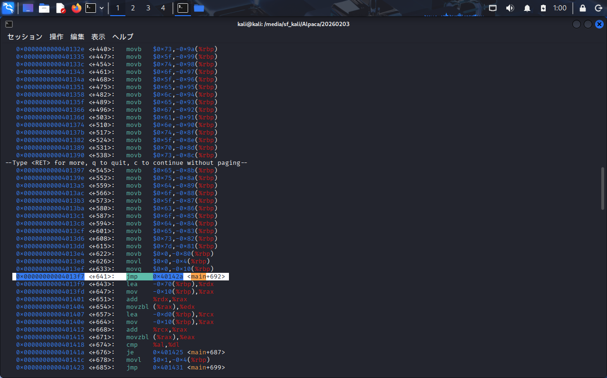

## 問題理解
バイナリファイルです。読めない(本心)

※AlpacaCTF2月3日,問題文から引用
問題文にこのようにあるので入力した文字列を何かしらの方法で検証して、入力文字列がFLAGと一致している場合正解を出す(と書いてある)


## 解法
gdbを使います。でもgdb理解していません。

<details>
<summary>gdbとは</summary>
linux上で使えるC言語などのデバッガ。変数を見たり関数を見たりブレークポイントを張ったりする。
自分でも説明できないほど色々できます。
</details>
下記の流れをもって答えを出しました。ただ、リバースエンジニアリング初心者系なのでAIくんに頼った結果でもあります。

### 1. 関数一覧表示
`disassemble main`
中身をAIに確認したところ、下記の流れをしていることが分かった。
1. 入力の受け取り
2. 正解データの構築(配列の中に一文字ずつ入れている)
3. 文字列比較をするループ処理
4. 判定
この問題では比較をするために正解データの構築をしていることが分かったので、処理の段階で正解データを構築した後に処理を止めれば、正解データが分かる。

### 2.ブレークポイントの設定

画像の選択箇所より前が正解データの構築である。なのでデータが入れ終わった後に処理をいったん止める
`break *0x4013f7`
上記コマンドでブレークポイントを設定し、`run`コマンドで実行する

### 3. 変数の確認
runで実行した後、問題理解で出てきたinputが出てきたので適当に文字列を入れる。※1
実行した後、ブレークポイントで処理が止まる。その時点での変数一覧が見れるので変数を指定して中身を見ます。
`x/s $rbp-0xd0`
`x`はExamine (検査せよ)
`/s`はString (文字列として)
`$rbp-0xd0`はベースポインタから0xd0戻った場所
いまいち意味が分からなかったのでAIに聞きました
```
これは、「この関数内で使う変数（入力された文字や正解の文字）を置くために、208バイト分の広い机を用意した」ということです。

その後に出てくる -0xd0(%rbp) という書き方は、 「広げた机の一番端っこ（基準点 %rbp から 208バイト戻った地点）」を指しています。ここに文字 'A' ($0x41) を置いたわけです。

まとめると:

・sub $0xd0, %rsp: 「208バイトの作業スペースを確保！」（場所取り）

・movb $0x41, -0xd0(%rbp): 「確保したスペースの端っこに 'A' を置く！」（配置）

という流れになっています。
```
分かりませんでした。writeup書いているのに意味が分かってません終わった
<details>
<summary>FLAG</summary>
Alpaca{Decompiers_can_optimize_redundant_assembly_codes_to_elegant_pseudo_codes}"
</details>


※1.適当でいいのは、確認したいのは入力した文字列ではなく、構築された正解データなので。）