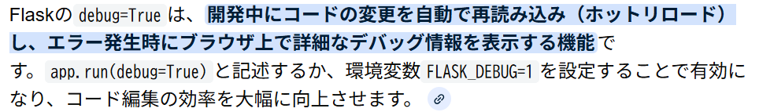
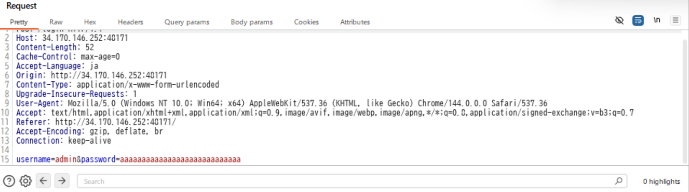
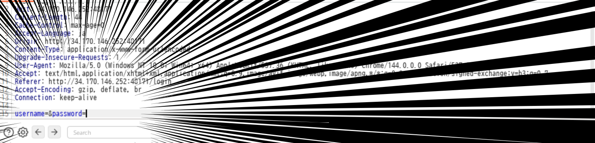
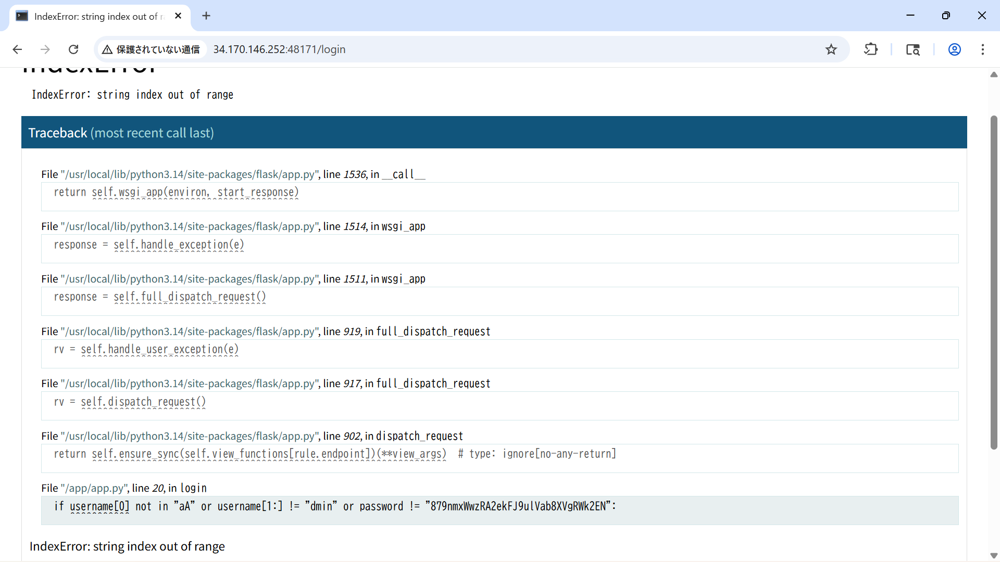

## 問題理解
この問題はフロント側から`username`と`password`の入力を受け取り、バックエンドで検証した後、正解だった場合flagが表示されるページに遷移される問題。またフロント側では**最低5文字の入力**が設定されている
バックエンド(app.py)では下記のif文によって検証をしている
```python
if username[0] not in "aA" or username[1:] != "dmin" or password != "**REDACTED**":
        return render_template("login.html", error="You are not Admin"), 401
```
- `username`の1文字に`a`もしくは`A`が含まれていない
- `username`の2文字目以降に`dmin`の文字が含まれていない
- `password`の文字列が指定した文字列(配布されたコードの場合は`REDACTED`)ではない場合
これらの場合は処理がTrueとなり、login.htmlを返し「あなたは管理者じゃないよ」と言う文字列と401エラーを返す

## 解法
FLAGを得るためには`username`と`password`を取得する必要がある。`username`に関してはif文から`admin`もしくは`Admin`と考えられる。
`password`は**Flaskの`debug=True`の脆弱性を使う**
以下 geminiから

app.pyには`main`メソッドに下記の記述がある
```python
if __name__ == "__main__":
    app.run(host="0.0.0.0", port=3000, debug=True)
```
よってページ内でエラーを引き起こすことで解決できると判断した。
`username`,`password`ともに文字列がなければエラーを引き起こせるが、入力側で5文字以上の縛りが設けられているので**フロントの入力フォームを介さずにリクエストを送信すればいい**
burp suiteのintruder機能を使ってリクエストを書き替えて`admin`,`password`の中身を消して送信した
### 書き替え前

### 書き替え後

これによってFLASKのデバッグページに遷移する

こちらのページ下部にはソースコードでどの箇所がエラー起きたかが分かる、開発時には大変ありがたい機能があるが、本番環境時にはまずいです。
.jpg>)
上記スクショにある通りFLAGがもろ映ってますね

その他方法としてはcurlを使ってリクエスト送信などが挙げられます